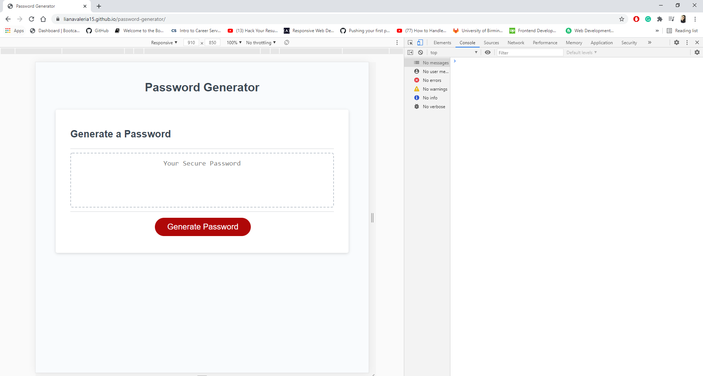
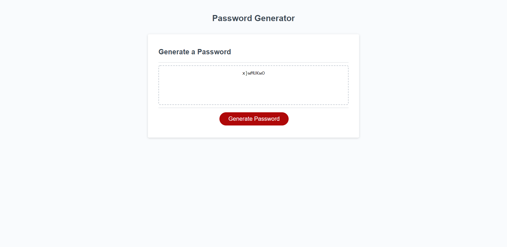

# Password generator

In this project I had to write a Javascript code that would randomly generate a password for clients. To complete the task, I was given already written HTML and CSS files, which I did not need to modify. I was also given a Javascript boilerplate, which included 2 functions: `writePassword()` and `generatePassword()`. My job was to understand the given problem and implement the whiteboarding technique to sketch the steps in building the solution.

## How did I approach the task?

1. I broke down the problem in little components as advised in the homework review session. For this I checked the assignment criteria for password generation and drew my `if` conditions.
2. I build the algorithm logic step-by-step on paper and then tried to visualize where

## How did I think my Javascript code?

1. I declared 4 arrays in the global memory in which I stored the lowercase, uppercase, special and numeric characters.
2. Inside `generatePassword()` I declared `prompt()`, `confirm()` and `alert()` function to ask what characters the clients wants.
3. Based on step 2, I declared a `if()` function to verify what arrays would be included in the final array from which I generate the function.
4.

## What I did in Javascript?

- I declared constant variables in which I stored arrays with the character options
- I declared a `generatePassword` function in which:
  - declared a new array to store the arrays of characters chosen by the client
  - created a prompt and confirm functions which would ask the client about the password length and types of characters
  - Inside password length validation function, I stored variables which check the characters options; after that I pushed into the password array the arrays chosen
  - I declared a `for` loop, which would pick a random array from `chosenCharArray` and a random character, which would then be pushed in a password array
  - as a last step, I transformed the password array into a string and returned the password to the client

## Link deployed password generator

Click [here](https://lianavaleria15.github.io/password-generator) to access the password generator.

## Screenshots deployed password generator

### Console screenshot

### Generated password

